
<h1 align="center">基于Java Web的在线电影票购买系统的设计与实现+vue</h1>

## 简介
在线电影网站购票系统：角色包括管理员与用户；实现在线电影购票、电影管理、订单管理、公告管理等功能，系统设计简洁直观，用户操作便捷，适用于毕业设计项目展示。    --计算机毕业设计源码；毕设源码；java毕业设计源码

## 联系方式

<h3 align="center">获取完整代码与数据库文件 + 微信：deepguan QQ: 86050149 QQ群: 783742310</h3>

<h3 align="center">可帮忙远程部署 包运行成功！提供远程部署、修改代码、设计文档指导、代码讲解等服务！</h3>

## 功能介绍（完整见运行截图）
管理员： 提供登录、注册、退出等身份验证功能，可通过导航菜单管理电影信息、电影厅、用户和公告类型，支持电影添加、编辑、删除等操作，查看订单详情并确认支付，公告类型管理功能允许新增和编辑公告分类。

用户： 实现登录和注册后可访问个人中心，查看和修改个人信息，查询订单，进行密码修改；支持电影搜索、分类筛选和详情查看，通过选择座位完成购票，提交评价及查看公告信息。

游客： 访问首页导航栏，浏览电影列表和公告内容，查看电影详情和票价，通过登录或注册获取完整功能体验。

系统： 提供多角色权限控制，支持后台管理与前台用户互动；包括数据维护、订单管理和实时公告展示功能，确保高效、安全的操作环境。

## 运行截图
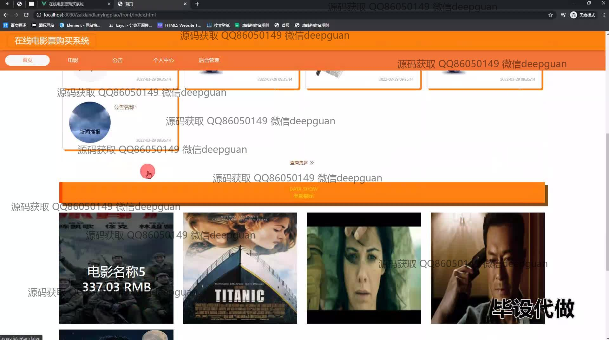
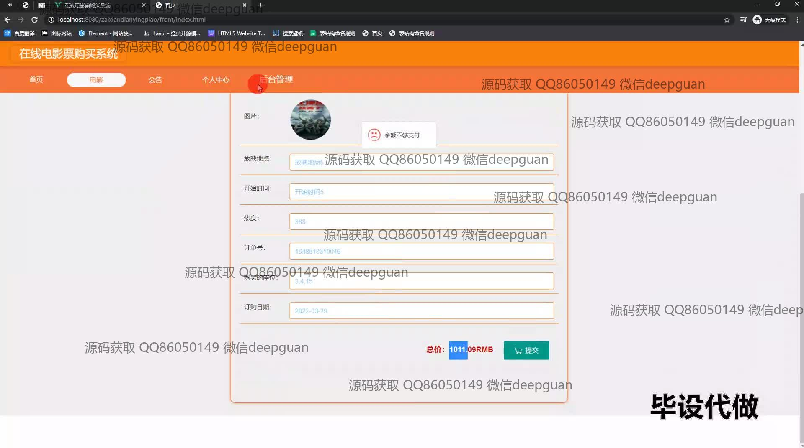
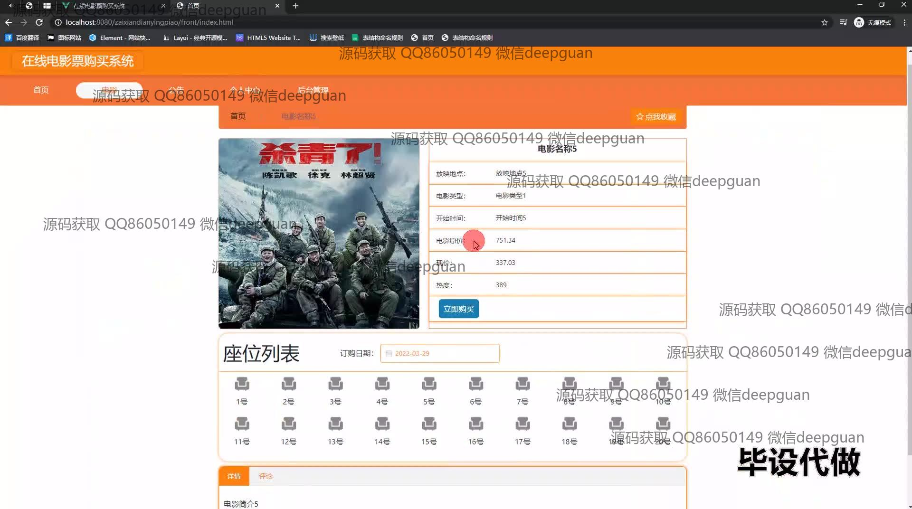
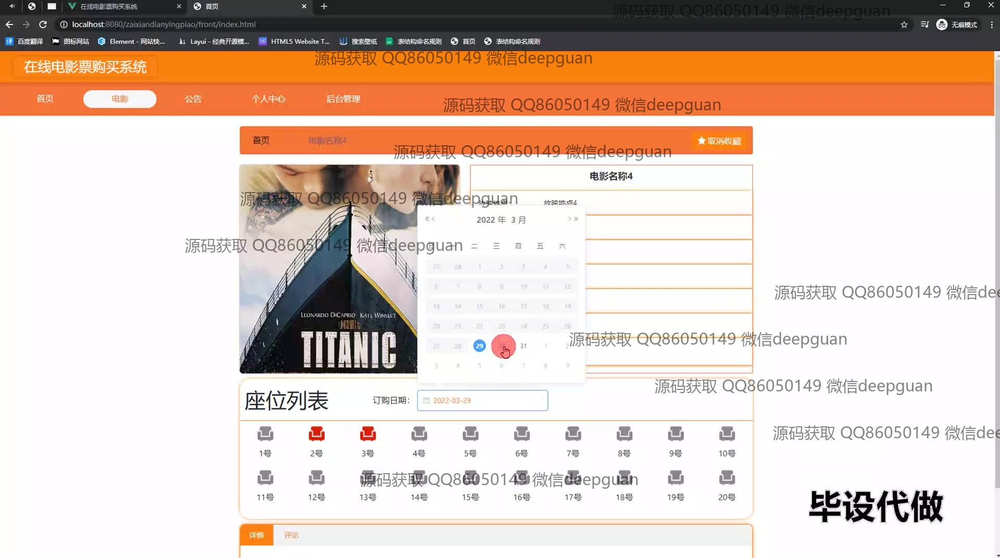
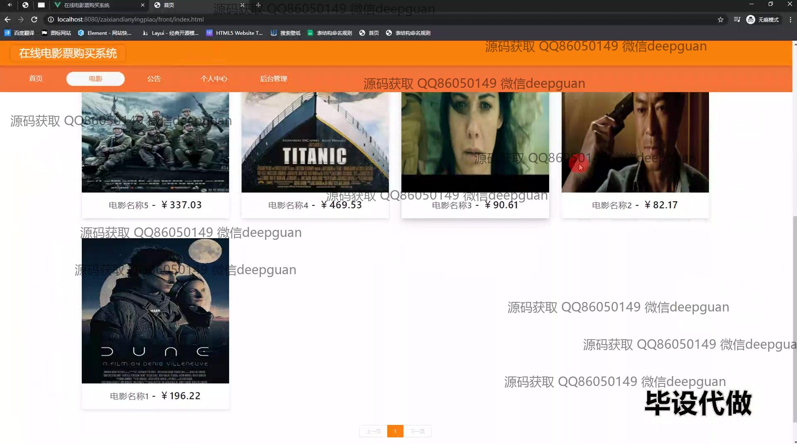
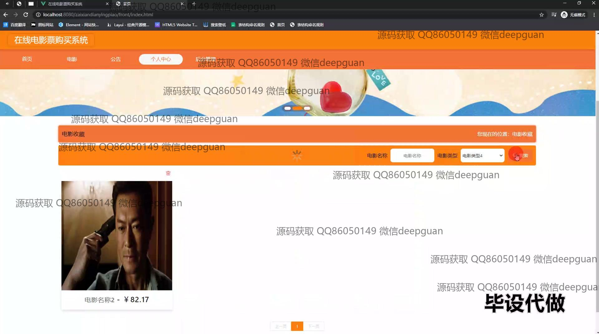
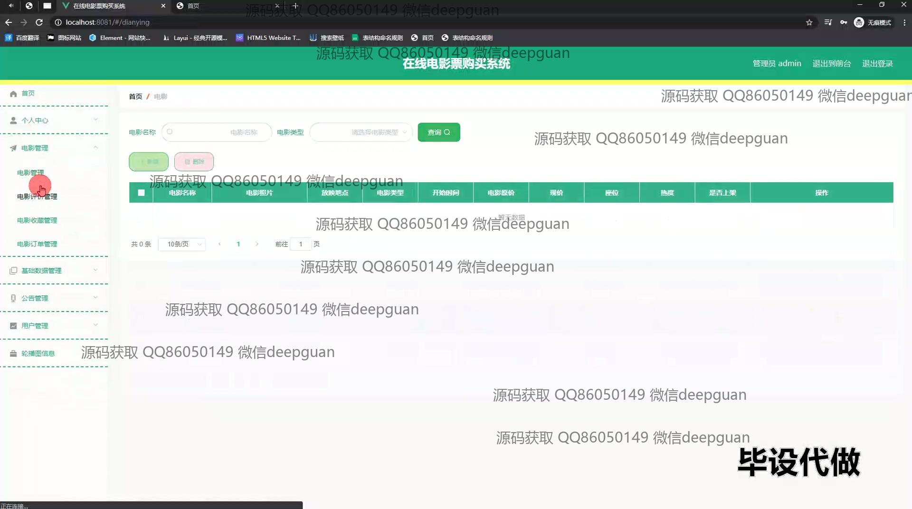
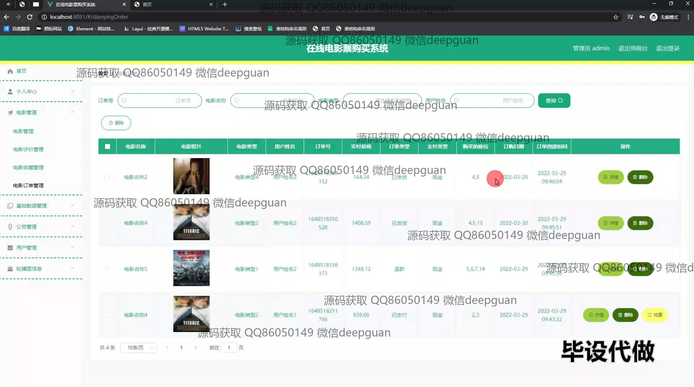
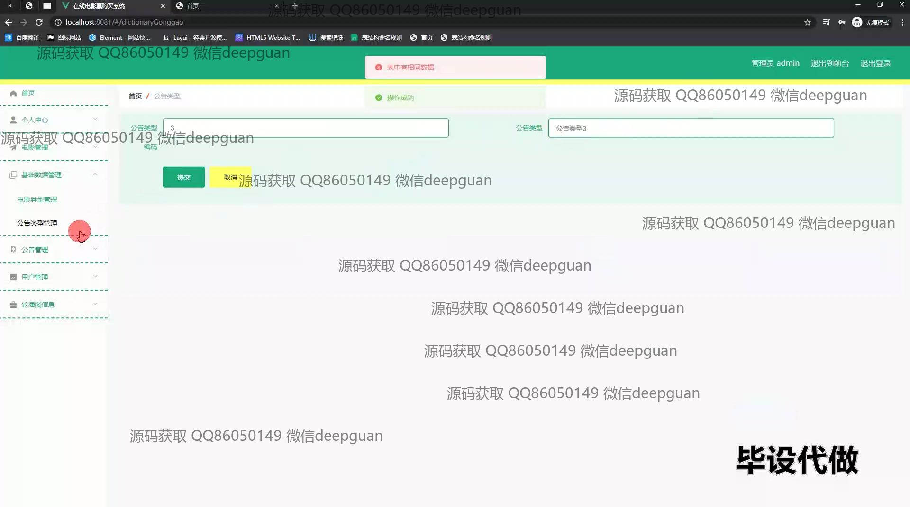
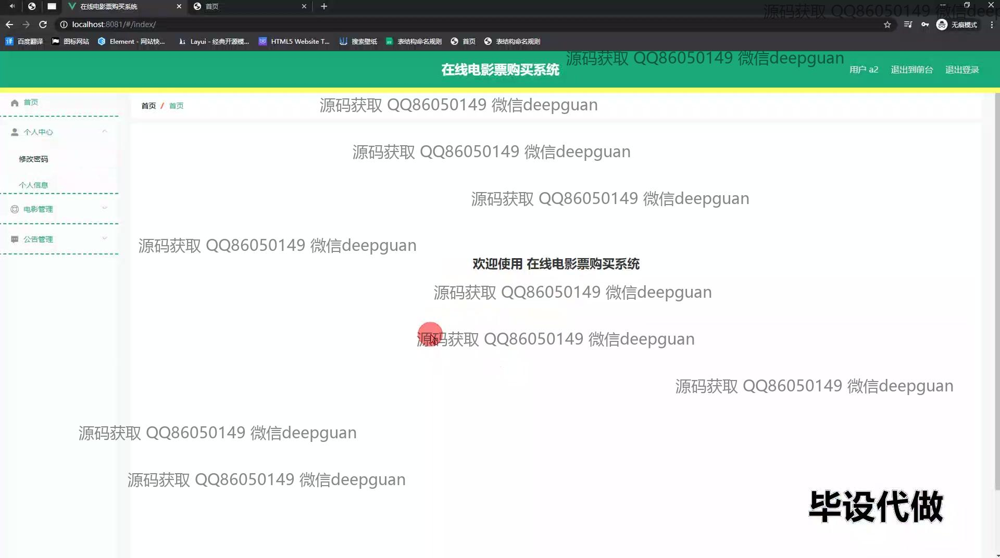
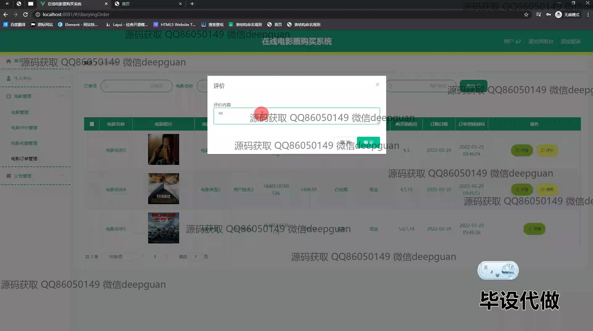

本代码来源于网络,仅供学习参考使用!

